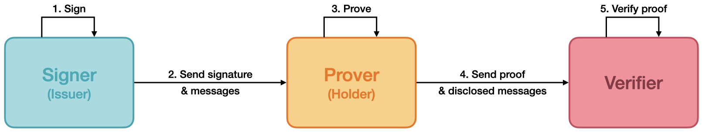
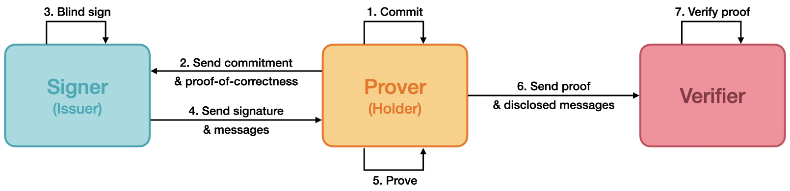

# bbs-signature

[](https://github.com/herculas/bbs-signature/actions/workflows/release.yml)

A BBS Signature Scheme foundation library written in Rust, compiled to WASM to provide JavaScript and TypeScript
interfaces. This library is compatible with the specifications of
[The BBS Signature Scheme (version 7)](https://datatracker.ietf.org/doc/html/draft-irtf-cfrg-bbs-signatures-07),
[Blind BBS Signatures (version 0)](https://datatracker.ietf.org/doc/html/draft-irtf-cfrg-bbs-blind-signatures-00), and
[BBS Per Verifier Linkability (version 0)](https://datatracker.ietf.org/doc/html/draft-irtf-cfrg-bbs-per-verifier-linkability-00).

## Background

### BBS Signature Scheme

BBS Signature scheme originated from the work [BBS04](https://link.springer.com/chapter/10.1007/978-3-540-28628-8_3) of
Beneh, Boyen, and Shacham. Subsequently, Au et al. presented the first provably secure version of BBS signature in
[ASM06](https://link.springer.com/chapter/10.1007/11832072_8). Later, Camenisch et al., Barki et al., and Tessaro et al.
made improvements to BBS signature's performance and security in [CDL16](https://eprint.iacr.org/2016/663),
[BBDT16](https://link.springer.com/chapter/10.1007/978-3-319-69453-5_20), and [TZ23](https://eprint.iacr.org/2023/275)
respectively. This library is based on the latest achievements from this series of work.

Digital signatures ensure data integrity and authenticity. BBS signatures and BBS proofs extend these capabilities with
three key features:

- **Selective Disclosure**: Signers can sign multiple messages into a single fixed-size signature. A prover can then
  generate proof that reveals only specific messages while keeping others private, all while maintaining the integrity
  of the disclosed information.
- **Unlinkable Proofs**: The proofs are zero-knowledge, meaning verifiers cannot identify which original signature
  created the proof. This prevents correlation through signatures. Even proofs from the same signature appear completely
  random and unrelated.
- **Proof of Possession**: The proofs are proofs-of-knowledge that demonstrate to the verifier that the prover holds a
  valid signature without revealing it. The scheme also allows binding metadata (called a _presentation header_) to the
  proof, which can include cryptographic nonces, audience/domain identifiers, or time-based validity information.

The following flowchart illustrates the key participants and data flows in this scheme.

<picture>
  <source media="(prefers-color-scheme: dark)" srcset="./assets/readme/bbs-signature-dark.png">
  
</picture>

### Blind BBS Signature

In the BBS Signature scheme, generating a BBS proof requires a valid signature. This means that if signatures are leaked
through eavesdropping, phishing attacks, or other channels, attackers could impersonate the prover. In blind signature
scenarios, the prover can obtain a valid signature while keeping the messages hidden from the signer, though the signer
may still add their own chosen messages to the signature.

The BBS blind signature scheme builds upon the basic BBS signature scheme by enabling provers to receive valid
signatures for messages that remain unknown to the signer. The process works as follows: the holder (also called the
prover in the BBS scheme) first creates commitments to their secret messages and sends these commitments to the signer
along with proofs of their correctness. The signer then verifies these proofs and, if verification is successful, signs
the commitments.

The following flowchart illustrates the key participants and data flows in the blind signature scheme.

<picture>
  <source media="(prefers-color-scheme: dark)" srcset="./assets/readme/blind-bbs-signature-dark.png">
  
</picture>

### Pseudonym BBS Signature

BBS proofs are designed to be unlinkable—given two different BBS proofs, it's impossible to determine if they come from
the same BBS signature. When provers don't reveal additional identity information, verifiers cannot cryptographically
track or link different proof presentations, enhancing user privacy. However, some applications require verifiers to
track BBS proofs from the same prover for security monitoring, monetization services, and configuration persistence. For
privacy protection, provers must not reveal or bind a persistent unique identifier across different verifiers, as this
would enable linking of the prover's interactions.

To address these challenges, we can introduce pseudonyms into BBS proofs. A pseudonym remains constant when a prover
presents proofs to the same verifier but changes and becomes unlinkable when interacting with different verifiers. This
allows verifiers to track presentations made to them while preventing tracking of prover interactions with other
verifiers.

To achieve this balance between traceability and privacy, we introduce a pseudonym system where values remain constant
for individual verifier-prover pairs but change across different verifiers, with no correlation possible between
different pseudonym values. We construct each pseudonym by combining a unique verifier identifier with a unique prover
identifier. To prevent forgery, the prover's identifier is signed by the same BBS signature used for the proof
generation. This approach requires enhanced BBS proof operations with additional computations to verify the pseudonym's
correctness—specifically proving its proper calculation using the verifier identifier and the undisclosed, signed prover
identifier.

The prover identifier must remain confidential, as its exposure would enable tracking of the prover's activities across
all verifiers. When implemented correctly, pseudonyms prevent both verifier-verifier collusion (verifiers correlating
proof presentations among themselves) and verifier-signer collusion (signers correlating prover presentations to
verifiers).

## Getting started

To refer to this package within your Deno project, run:

```shell
deno add jsr:@herculas/bbs-signature
```

## Usage

### Keypair generation

Generate a BLS12-381 keypair deterministically from a secret key material, an info string, and a domain separation tag.

```js
const { secretKey, publicKey } = generateKeypair(
  "<key_material>",
  "<key_info>",
  "<key_dst>",
  "BLS12_381_G1_XOF_SHAKE_256" | "BLS12_381_G1_XMD_SHA_256",
)
```

### Signing

Generate a BBS Signature from a secret key, over a header, and a set of messages.

```js
const signature = sign(
  "<secret_key>",
  "<public_key>",
  "<header>",
  "<messages>",
  "BLS12_381_G1_XOF_SHAKE_256" | "BLS12_381_G1_XMD_SHA_256",
)
```

### Verifying

Validate a BBS Signature, given a public key, a header, and a set of messages.

```js
const verification = verify(
  "<public_key>",
  "<signature>",
  "<header>",
  "<messages>",
  "BLS12_381_G1_XOF_SHAKE_256" | "BLS12_381_G1_XMD_SHA_256",
)
```

### Proving

Generate a BBS proof, which is a zero-knowledge proof-of-knowledge of a BBS Signature, while optionally disclosing any
subset of the signed messages.

Other than the signer's public key, the BBS Signature and the signed header and messages, the operation also accepts a
presentation header, which will be bound to the resulting proof. To indicate which of the messages are to be disclosed,
the operation accepts a list of integers in ascending order, representing the indexes of those messages.

```js
const proof = prove(
  "<public_key>",
  "<signature>",
  "<header>",
  "<presentation_header>",
  "<messages>",
  "<disclosed_indexes>",
  "BLS12_381_G1_XOF_SHAKE_256" | "BLS12_381_G1_XMD_SHA_256",
)
```

### Proof validating

Validate a BBS proof, given the signer's public key, a header, a presentation header, the disclosed messages, and the
indexes of those messages in the original vector of signed messages.

Validating the proof guarantees authenticity and integrity of the header and disclosed messages, as well as knowledge of
a valid BBS Signature.

```js
const validation = validate(
  "<public_key>",
  "<proof>",
  "<presentation_header>",
  "<disclosed_messages>",
  "<disclosed_indexes>",
  "BLS12_381_G1_XOF_SHAKE_256" | "BLS12_381_G1_XMD_SHA_256",
)
```
